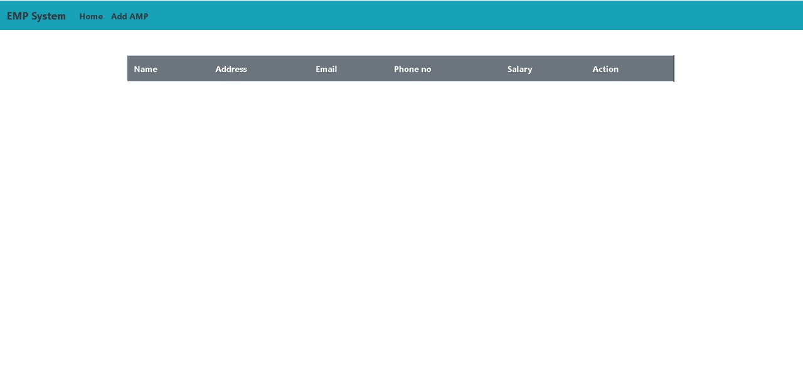
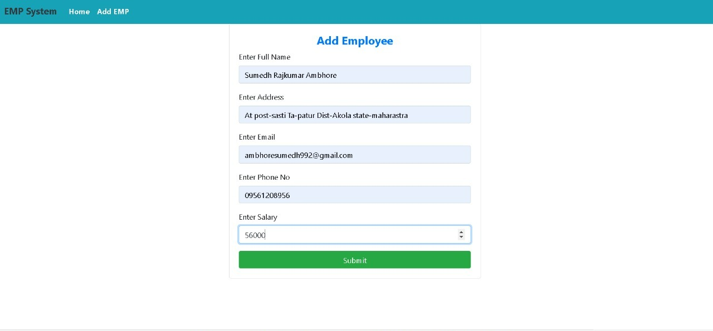
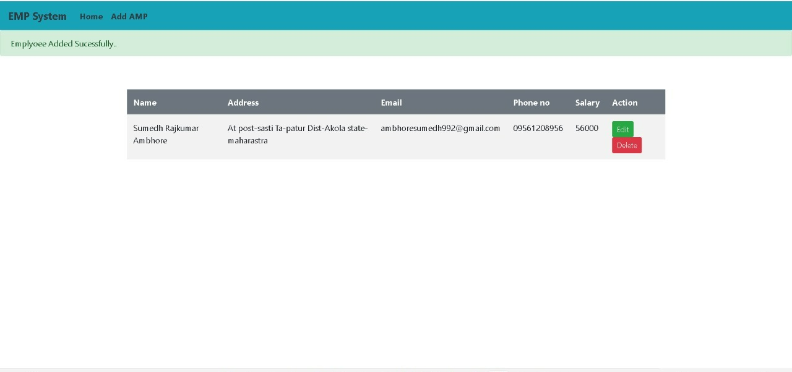
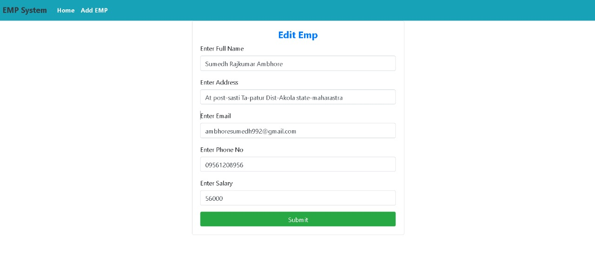

# Spring Boot Crud Example| Employee Management System Spring Boot Project
March 16, 2022 by sumedh Ambhore

## contents

* EmpSystemApplication.java
* EmpControlle.java
* Employee.java
* EmpRepo.java
* EmpService.java

* HTML Code
* add_emp.html
* edit.html
* index.html
* application.properties
* pom.xml
* Conclusion

## Spring Boot Crud Example Prerequisite

* Spring tool suite (STS) IDE
* Mysql Database
* mysql Workbench

## Home Page

  

## Add Employee

  

## View Employee

  

## Edit Employee Details

  

